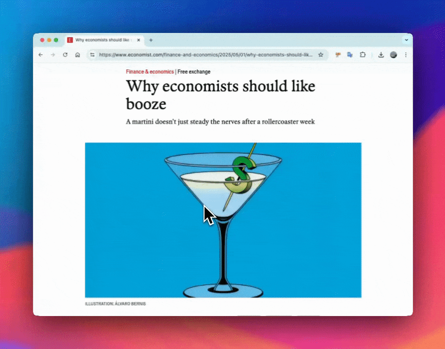

選取英文單字後，自動翻譯並新增到指定的 Notion 頁面中。目前僅支援 英文 -> 繁體中文

## 🔧 啟用步驟（Setup Instructions）

1. **Clone 或下載此專案**
   ```bash
   git clone https://github.com/chiwei82/build_sth
   cd notion-vocab-extension
   ```

2. **開啟 Chrome 擴充功能頁面**
   - 在 Chrome 瀏覽器輸入 `chrome://extensions/`
   - 開啟右上角「開發人員模式（Developer mode）」

3. **載入未封裝的擴充功能**
   - 點擊「載入已解壓縮的擴充功能（Load unpacked）」
   - 選取 notion_vocab_extension 資料夾（包含 `manifest.json` 的那個資料夾）

4. **設定 Notion 整合**
   - 點擊瀏覽器右上角的擴充功能圖示
   - 將以下資訊輸入對應欄位並點擊「儲存設定」：
     - `Integration Token`（從 Notion 建立的 integration token）
     - `Database ID`（你的 Notion database ID）
   - 設定 Database connections, 詳細請參閱 [Notion API 教學 →](https://developers.notion.com/docs/authorization#integration-permissions)

5. **更改欄位名稱**
   - 因為要透過 API 去建立，欄位名稱需要在 background.js中修改
   - 目前我是先設定好的，shcema 格式如下，詳細請參閱 [Notion API 教學 →](https://developers.notion.com/docs/working-with-databases)
   ```
    properties: {
        word: { title: [{ text: { content: word } }] },
        type: { rich_text: [{ text: { content: formattedPOS } }] },
        Meaning: { rich_text: [{ text: { content: meaning } }] }
    }
   ```

**使用方式**
- 在任意網頁上**選取一個英文單字**
- 點擊彈出的按鈕（類似 Google 翻譯的選字提示）
- extension 將自動：
    - 翻譯該單字
    - 儲存詞性（例如：`revamp 改造 verb`）
    - 新增到你指定的 Notion database 頁面

---